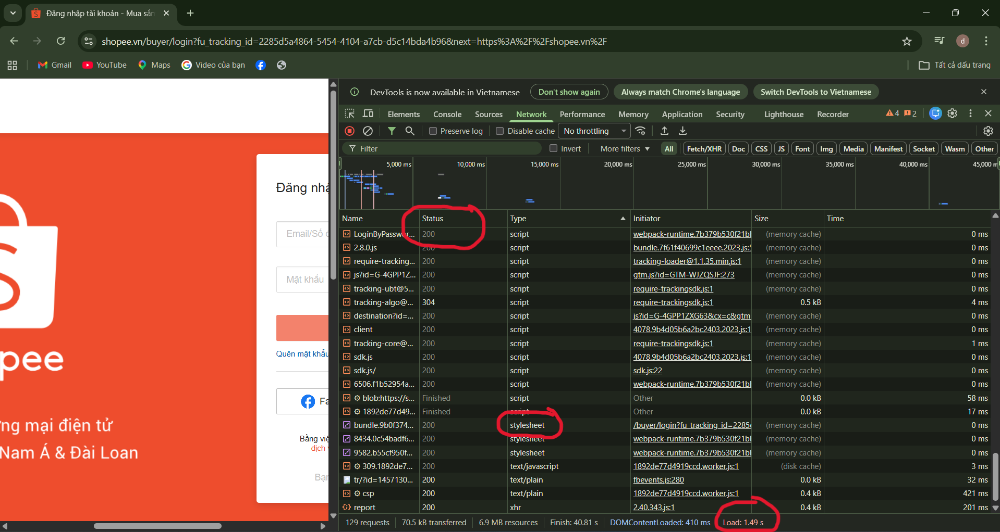

Câu A1:
1.Thứ tự 5 bước xảy ra:
  Bước 1: Request của bạn xuất phát từ laptop đi qua router WiFi nhà trọ.
  Bước 2: Qua nhà mạng VNPT chạy xuyên cáp quang dưới đáy Thái Bình Dương.
  Bước 3: Đến data center của trụ sở Shopee.
  Bước 4: Server Shopee xử lý request (ví dụ: truy xuất các mặt hàng sale, giỏ hàng).
  Bước 5: Response chạy ngược lại (Cáp quang - VNPT - router - laptop); Chrome nhận file HTML, CSS, JS và render ra giao diện trang chủ Shopee.
  * Nguồn tham chiếu: tuan_1_html5/01_introduction_html_universe.md - Mục: 🎬 Cuộc Hành Trình 0.3 Giây Xuyên Đại Dương.
2.Trong tab Network khi truy cập shopee:
    - Status Code: 200 (yêu cầu thành công)
    - Tổng thời gian load lại: 1.49s
    - Request CSS: xác định qua cột Type là "Stylesheet"
    * Ảnh minh họa: 

Câu A2:
### Câu A2 — Semantic HTML
**4 lỗi Semantic và cách sửa:**
1. Lỗi: Dùng `<div class="header">` -> Sửa: Thay bằng thẻ `<header>`.
2. Lỗi: Dùng `<div class="menu">` -> Sửa: Thay bằng thẻ `<nav>`.
3. Lỗi: Dùng `<div class="main">` -> Sửa: Thay bằng thẻ `<main>`.
4. Lỗi: Dùng `<div class="footer">` -> Sửa: Thay bằng thẻ `<footer>`.

**Code sửa lại:**
```html
<header>
    <h1>ShopTLU</h1>
    <nav>
        <a href="/">Trang chủ</a>
        <a href="/products">Sản phẩm</a>
    </nav>
</header>
<main>
    <article>
        <h2>iPhone 16 Pro</h2>
        <p>25.990.000đ</p>
    </article>
</main>
<footer>© 2026 ShopTLU</footer>
```

Câu A3:
---------------------------
|          Hộp 1          |  <- (Dòng 1: Block chiếm hết hàng)
---------------------------
Text A  Text B               <- (Dòng 2: Inline nằm chung hàng)
---------------------------
|          Hộp 2          |  <- (Dòng 3: Block chiếm hết hàng)
---------------------------
Text C  **Text D** <- (Dòng 4: Inline nằm chung hàng)
---------------------------
|          Hộp 3          |  <- (Dòng 5: Block chiếm hết hàng)
---------------------------
* giải thích chi tiết:
- Dòng 1, 3, 5: Hiển thị dưới dạng một khối riêng biệt, chiếm trọn 100% chiều ngang của trình duyệt. Điều này là do thẻ <div> là phần tử khối (Block), nó luôn bắt đầu trên một dòng mới và chiếm hết chiều rộng khả dụng.

- Dòng 2: "Text A" và "Text B" nằm sát nhau trên cùng một hàng vì thẻ <span> là phần tử nội dòng (Inline). Nó chỉ chiếm không gian vừa đủ để chứa nội dung và không tạo dòng mới.

- Dòng 4: "Text C" và "Text D" cũng nằm chung một hàng. Trong đó "Text D" được bôi đậm vì thẻ <strong> là phần tử Inline có kèm theo định dạng nhấn mạnh (bold).

* Nguồn tham chiếu: tuan_1_html5/02_basic_structure_html.md - Phần: Các thẻ cơ bản trong <body>.

Câu A4:
* Sự khác nhau giữa các thẻ:
<thead>: Phần đầu bảng, chứa tiêu đề các cột.
<tbody>: Phần thân bảng, chứa nội dung dữ liệu chính.
<tfoot>: Phần chân bảng, dùng để tổng kết hoặc ghi chú.

* Lý do không dùng table để làm layout:
- Sai semantic (Table chỉ dùng để hiển thị dữ liệu bảng).
- Khó tùy chỉnh co giãn giao diện (Responsive) trên điện thoại.
- Cấu trúc thẻ lồng nhau phức tạp (tr, td) làm code bị rối và khó bảo trì.

* Nguồn tham chiếu: tuan_1_html5/05_tables_hyperlinks.md - Phần: Table - Bảng dữ liệu.


PHẦN B-BÀI B3:DEBUG HTML    
Liệt kê các lỗi trong đoạn code gốc:

Lỗi 1: Dòng 1 – Thiếu khai báo loại tài liệu html trong thẻ DOCTYPE – Cách sửa: Sửa thành <!DOCTYPE html>.
Lỗi 2: Dòng 2 – Thẻ <html> thiếu thuộc tính ngôn ngữ – Cách sửa: Thêm lang="vi" hoặc lang="en".
Lỗi 3: Dòng 6 – Thẻ <meta charset> viết sai giá trị "utf8" – Cách sửa: Sửa chính xác thành charset="UTF-8".
Lỗi 4: Dòng 6 – Thẻ <meta> đặt sau thẻ <title> – Cách sửa: Đưa thẻ <meta charset> lên trên cùng ngay sau thẻ <head>.
Lỗi 5: Dòng 9 – Thẻ kết thúc <h1> viết nhầm thành <h1> – Cách sửa: Đổi thành </h1>.
Lỗi 6: Dòng 11 – Thẻ <header> đặt bên trong thẻ <body> nhưng sau <h1> là sai cấu trúc logic – Cách sửa: Đưa <h1> vào bên trong thẻ <header>.
Lỗi 7: Dòng 13 – Thẻ kết thúc <a> thiếu dấu gạch chéo / – Cách sửa: Sửa thành </a>.
Lỗi 8: Dòng 13 – Thuộc tính href="home" không dẫn đến một liên kết hoặc ID hợp lệ – Cách sửa: Sửa thành href="index.html" hoặc href="#".
Lỗi 9: Dòng 10 – Sử dụng các khoảng trống xuống hàng thừa không cần thiết giữa thẻ <body> và <header> – Cách sửa: Xóa bớt khoảng trắng để code gọn gàng.
Lỗi 10: Tổng thể – Thiếu các thẻ đóng quan trọng ở cuối file như </nav>, </header>, </body>, </html> – Cách sửa: Thêm đầy đủ các thẻ đóng theo đúng thứ tự lồng nhau.